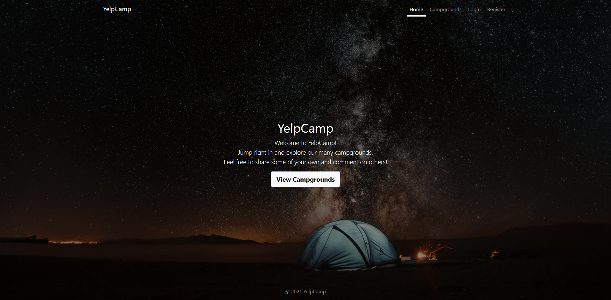
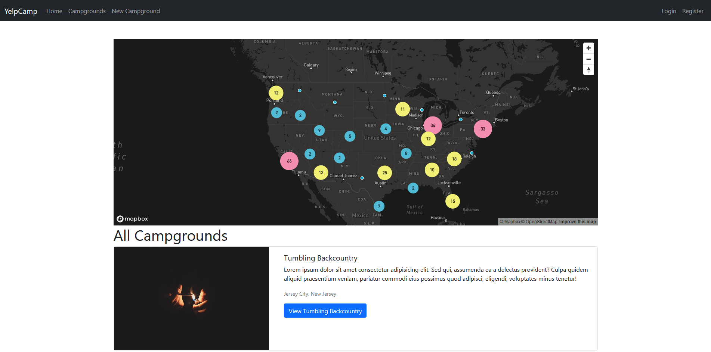
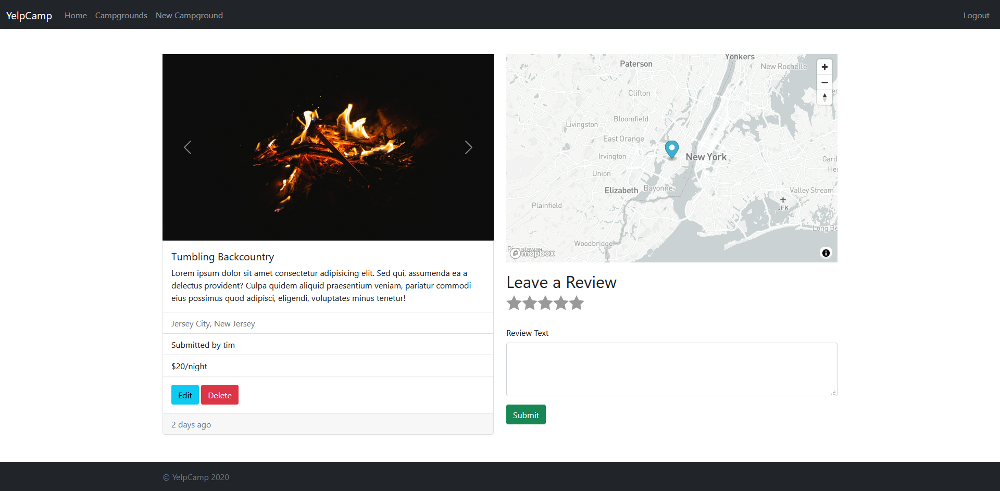

# YelpCamp
YelpCamp is a RESTful website about campgrounds.

## Prerequisites
* Node.js
* npm
* mongoDB

## Installation
* Install the required dependencies using `npm install`
* Create an account at [cloudinary.com](https://cloudinary.com/) and [mapbox.com](https://www.mapbox.com/)
* Create a `.env` file which contains
```.env
CLOUDINARY_CLOUD_NAME=YOUR_CLOUDINARY_CLOUD_NAME
CLOUDINARY_KEY=YOUR_CLOUDINARY_KEY
CLOUDINARY_SECRET=YOUR_CLOUDINARY_SECRET
MAPBOX_TOKEN=YOUR_MAPBOX_TOKEN
```
* Start the server using `node app.js`
* Create an YelpCamp account and go to mongoDB to see your user id
* Paste user id to `seeds/index.js`
```seeds/index.js
author: "YOUR_USER_ID",
```
* Run the seeds file using `node seeds/index.js`
* Restart the server

### Homepage


### Campgrounds


### Campground


